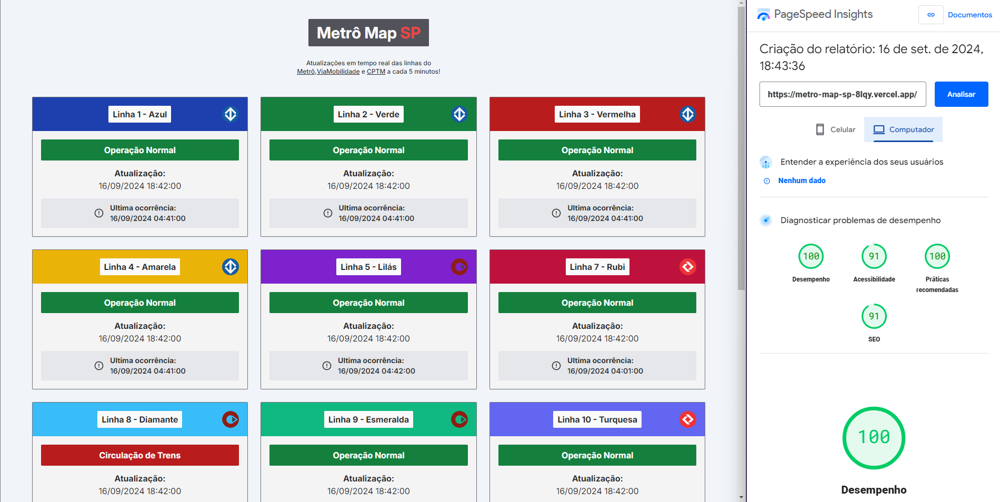

## Metrô Map SP

Metrô Map SP é uma aplicação desenvolvida para listar as linhas de metrô da cidade de São Paulo. Os dados são fornecidos por uma API de terceiros e incluem informações detalhadas sobre cada linha.

## Funcionalidades:

- Listagem de linhas do metrô disponíveis

## Technologies Used:

    * Frontend
    * React
    * TailwindCSS
    * Prettier plugin tailwindcss
    * Axios

## Acesse aqui:
<a href="https://metro-map-sp-8lqy.vercel.app/">
Clique Aqui!
</a>
